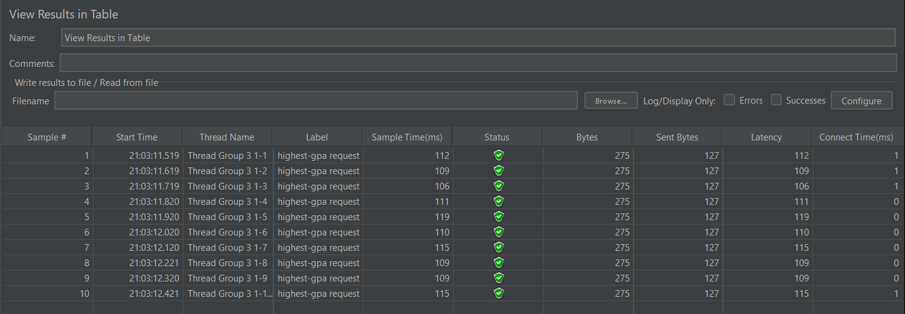

Nama: Lucinda Laurent 
NPM: 2206024745 
Kelas: Adpro B 

# Tutorial 5

* Screenshot of JMeter test plans execution results through the GUI 
##### /all-student-name

##### /highest-gpa

##### /all-student (for comparison only)

* Screenshot of JMeter test plans execution results through the command line
##### /all-student-name

##### /highest-gpa

* Optimizing endpoint

* Re-measurement through JMeter after performance optimization
##### /all-student-name

##### /highest-gpa

##### /all-student (for comparison only)

 
Setelah dilakukan optimisasi pada setiap method yang berhubungan dengan end-point
yang diakses, hasil pengukuran performa menggunakan jmeter mengalami peningkatan yang cukup signifikan.
Artinya, optimisasi performa method-method yang memang berperan penting dalam suatu aplikasi akan mempercepat response time atas request yang diterima oleh aplikasi tersebut.
### Reflection 
1. What is the difference between the approach of performance testing with JMeter and profiling with IntelliJ Profiler in the context of optimizing application performance?

Jmeter berguna untuk mengetes performa aplikasi dengan melakukan simulasi ketika suatu aplikasi diakses pada berbagai kondisi, biasanya untuk mengetes apakah aplikasi tersebut masih berjalan dengan lancar ketika diakses oleh banyak orang. Jmeter memberikan informasi waktu dari awal request dikirimkan hingga response diterima. Di sisi lain, IntelliJ Profiler tidak mensimulasikan kondisi ketika aplikasi diakses oleh banyak orang. Namun, IntelliJ Profiler memberikan informasi "internal" yang lebih mendetail, seperti waktu spesifik dari setiap method yang dipanggil untuk menyelesaikan suatu request. Dengan menggunakan profiler, kita jadi tahu bagian kode mana yang memerlukan waktu lama untuk dijalankan sehingga dapat dipertimbangkan untuk dilakukan optimisasi.

2. How does the profiling process help you in identifying and understanding the weak points in your application?

Profiler memberikan informasi yang mendetail mengenai seluruh proses yang terjadi untuk menyelesaikan suatu request. Terdapat informasi seperti total time, cpu time, dan memory allocations dari setiap method yang terlibat. Hal ini dapat membantu dalam menemukan bagian kode yang potensial untuk dioptimisasi.

3. Do you think IntelliJ Profiler is effective in assisting you to analyze and identify bottlenecks in your application code?

Ya, IntelliJ Profiler sangat membantu saya dalam mengidentifikasi bottlenecks pada aplikasi saya. Profiler sudah terintegrasi langsung pada IDE sehingga proses untuk melakukan performance testing lebih mudah dan praktis. Alat-alat yang disediakan oleh Profiler juga sudah cukup lengkap sehingga akan sangat membantu saya ketika mengidentifikasi bottlenecks.

4. What are the main challenges you face when conducting performance testing and profiling, and how do you overcome these challenges?

Tantangan yang saya hadapi adalah tools untuk melakukan performance testing dan profiling ini belum pernah saya gunakan sebelumnya sehingga saya masih tidak terbiasa dalam menggunakan tools tersebut. Solusinya saya bertanya kepada teman saya yang sudah punya pengalaman menggunakan tools tersebut, dan mencari tutorial tambahan di internet.
Selain itu, saya juga agak kesulitan menginterpretasikan hasil tes yang dilakukan oleh jmeter dan intellij profiler saat hasilnya tidak sesuai ekspektasi, misal ada 1 dari 10 thread yang gagal saat tes jmeter atau method yang seharusnya memerlukan banyak waktu untuk dijalankan malah tidak muncul di hasil tes profiler. Solusinya saya mencoba mengulang tes tersebut sambil mencari tahu apa penyebabnya.

5. What are the main benefits you gain from using IntelliJ Profiler for profiling your application code?

Manfaat yang paling saya rasakan adalah saya mudah menemukan potensi penyebab masalah terkait performance di kode saya. Profiler sudah mengurutkan setiap method berdasarkan waktu eksekusinya. Hal ini membuat saya tidak perlu repot-repot lagi mencari method mana yang paling bermasalah.

6. How do you handle situations where the results from profiling with IntelliJ Profiler are not entirely consistent with findings from performance testing using JMeter?

Jika terjadi situasi demikian, saya akan melakukan pengujian ulang karena bisa saja perbedaan hasil tersebut disebabkan oleh JIT compiler pada JVM yang belum optimal. Jika masih terdapat perbedaan yang besar, saya akan mengecek apakah terdapat perbedaan konfigurasi pada testing yang dijalankan oleh Profiler dan Jmeter. Kemudian saya akan menentukan hasil tes mana yang lebih sesuai dengan konteks aplikasi saya untuk dijadikan patokan optimisasi.

7. What strategies do you implement in optimizing application code after analyzing results from performance testing and profiling? How do you ensure the changes you make do not affect the application's functionality?

Setelah saya mendapatkan hasil analisis dari performance testing dan profiling, saya akan mengganti kode yang ada pada method yang bermasalah dengan kode yang lebih efisien, seperti mengganti struktur data sebelumnya dengan struktur data yang lebih efisien atau mengurangi kompleksitas algoritma. Untuk memastikan fungsionalitas aplikasi tidak terganggu, saya akan melakukan testing, seperti unitTests dan functionalTests untuk memastikan perubahan yang dilakukan tidak mempengaruhi fungsionalitas aplikasi.

